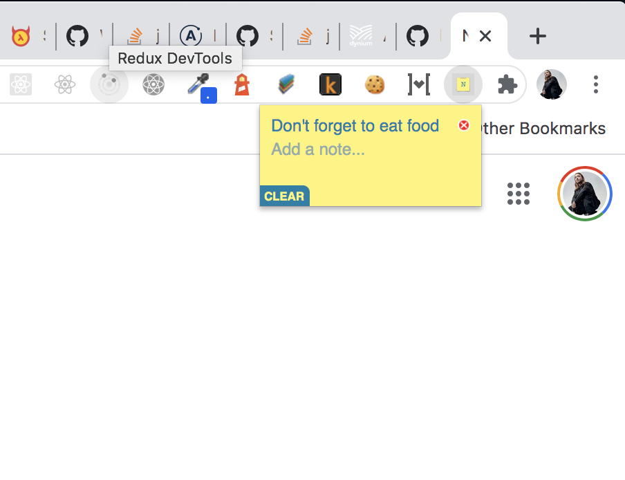

# README

# Notes
Notes is a vanilla js Chrome Extension to allow you to add simple notes which are cached in your browser and shared through the chrome api with any machines running chrome. A really cool thing about this API is that the app state will be protected by chrome itself, no db or creds necessary!

